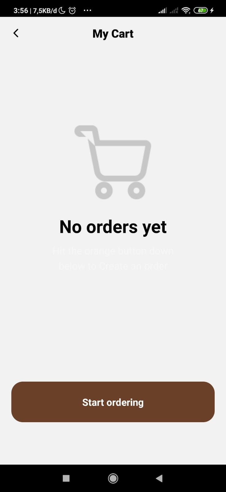
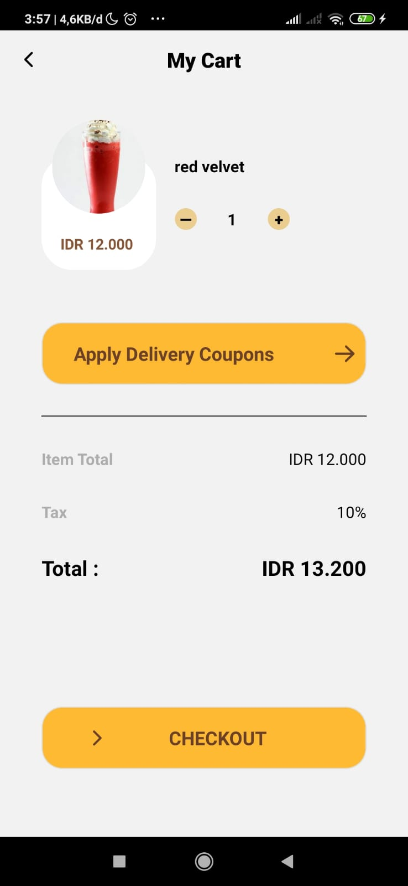
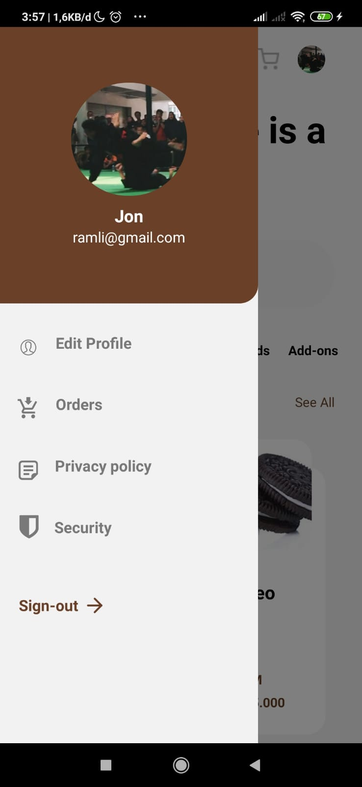
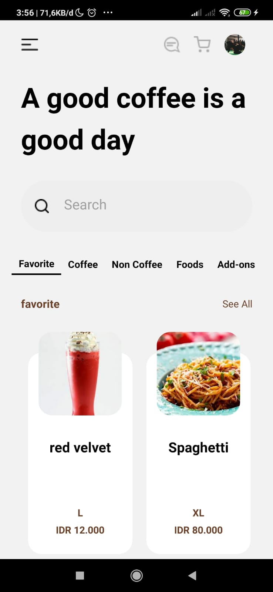
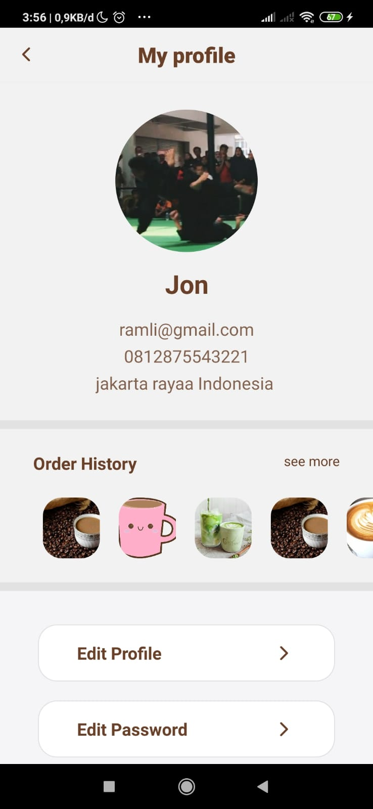

<h1>janjigacoffee Mobile</h1>

Coffee addict mobile adalah sebuah aplikasi yang bertujuan untuk mempermudah kedai coffee addict dalam menjual productnya secara online
<h2>Technologies Used</h2>

<ul>
<li>HTML</li>
</ul><ul>
<li>CSS</li>
</ul><ul>
<li>JavaScript</li>
</ul><ul>
<li>React</li>
</ul><h2>Setup</h2>

How to run this project ?
<h5>Steps</h5><ul>
<li>clone this project " https://github.com/rivalalfalah/janjigacoffee_android.git "</li>
</ul><ul>
<li>Open terminal and write " npm i "</li>
</ul><ul>
<li>Add file .env</li>
</ul><ul>
<li>split terimal and write " npm run android " and " npm rum start "</li>
</ul>

## Image Preview

<table border="2">
    

        
        
        
        
        
    

</table>

<h2>APK</h2>

- Click apk [`here`](https://bit.ly/3j8LXL2)

<h2>Related Project</h2>

- Coffee Addict Web  [`here`](https://github.com/rivalalfalah/janjigacoffee-react)
- Coffee Addict Backend  [`here`](https://github.com/rivalalfalah/janji_ga_coffee_new)